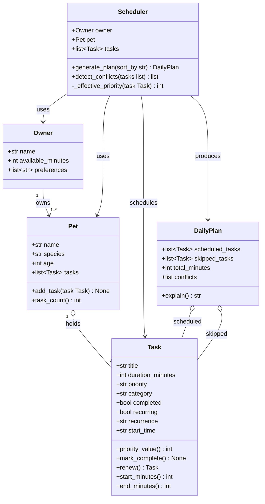

# PawPal+ Class Diagram

```mermaid
classDiagram
    class Owner {
        +str name
        +int available_minutes
        +list~str~ preferences
    }

    class Pet {
        +str name
        +str species
        +int age
        +list~Task~ tasks
        +add_task(task Task) None
        +task_count() int
    }

    class Task {
        +str title
        +int duration_minutes
        +str priority
        +str category
        +bool completed
        +bool recurring
        +str recurrence
        +str start_time
        +priority_value() int
        +mark_complete() None
        +renew() Task
        +start_minutes() int
        +end_minutes() int
    }

    class Scheduler {
        +Owner owner
        +Pet pet
        +list~Task~ tasks
        +generate_plan(sort_by str) DailyPlan
        +detect_conflicts(tasks list) list
        -_effective_priority(task Task) int
    }

    class DailyPlan {
        +list~Task~ scheduled_tasks
        +list~Task~ skipped_tasks
        +int total_minutes
        +list conflicts
        +explain() str
    }

    Owner "1" --> "1..*" Pet : owns
    Pet "1" o-- "0..*" Task : holds
    Scheduler --> Owner : uses
    Scheduler --> Pet : uses
    Scheduler --> Task : schedules
    Scheduler --> DailyPlan : produces
    DailyPlan o-- Task : scheduled
    DailyPlan o-- Task : skipped
```
