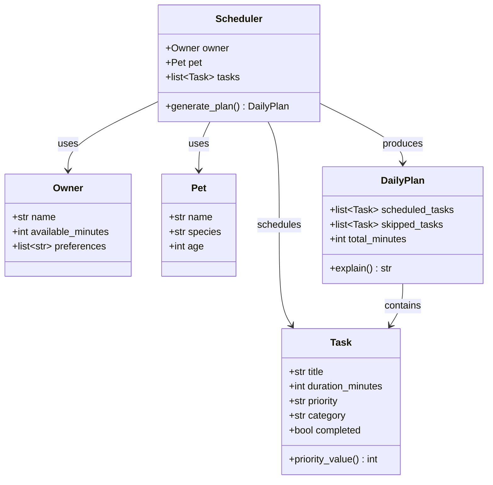

# PawPal+ Class Diagram

```mermaid
classDiagram
    class Owner {
        +str name
        +int available_minutes
        +list~str~ preferences
    }

    class Pet {
        +str name
        +str species
        +int age
    }

    class Task {
        +str title
        +int duration_minutes
        +str priority
        +str category
        +bool completed
        +priority_value() int
    }

    class Scheduler {
        +Owner owner
        +Pet pet
        +list~Task~ tasks
        +generate_plan() DailyPlan
    }

    class DailyPlan {
        +list~Task~ scheduled_tasks
        +list~Task~ skipped_tasks
        +int total_minutes
        +explain() str
    }

    Scheduler --> Owner : uses
    Scheduler --> Pet : uses
    Scheduler --> Task : schedules
    Scheduler --> DailyPlan : produces
    DailyPlan --> Task : contains
```
